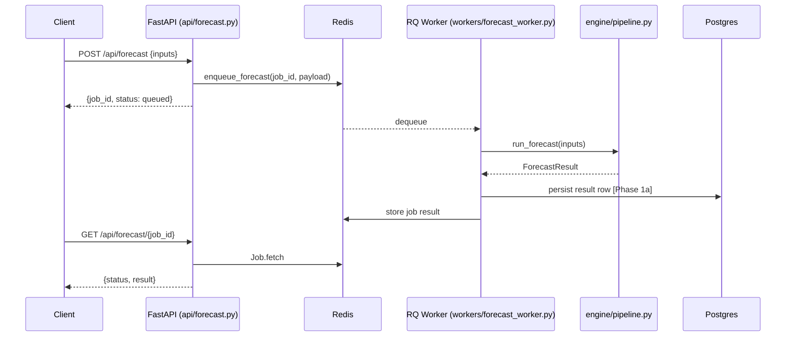

# Backend

FastAPI + pvlib + Postgres + Redis. Maps to `PRODUCT_PLAN.md` § Architecture: Extensible Modeling Engine.

## Layout (target — see [`docs/ENGINEERING.md`](../docs/ENGINEERING.md) for full spec)

```
backend/
  api/          FastAPI routes — thin orchestration, 5-second budget
  domain/       Pydantic models (inputs, outputs, events)        [Phase 1a]
  engine/       Pure pipeline: irradiance → DC → clipping → … → finance
    pipeline.py   composes steps
    steps/        one module per pipeline step
    registry.py   tier-aware step selection
  providers/    Ports + adapters (irradiance, tariff, geocoding, monitoring)  [Phase 1a]
  services/     Use-case orchestration (impure; emits events)    [Phase 1a]
  workers/      RQ consumers — long-running compute via the queue
  infra/        Logging, retry, idempotency, eventbus            [cross-cutting]
  prompts/      Versioned prompt templates                        [Phase 1b]
```

Hard rules: `domain/` and `engine/` are pure — no IO, no imports from `api/services/workers/providers/infra/`. Long-running work always goes through the queue.

## Forecast happy path



## Quickstart

```bash
uv sync
docker compose up -d postgres redis
uv run alembic upgrade head
uv run uvicorn backend.main:app --reload     # API on :8000
uv run python -m backend.workers.forecast_worker  # worker
uv run pytest
```

Health check: `curl http://localhost:8000/api/health`.

## Configuration

`backend/config.py` (Pydantic Settings) is the single source of truth for env vars; `.env.example` documents every field. See [`docs/SECRETS.md`](../docs/SECRETS.md) for production secret-management.
